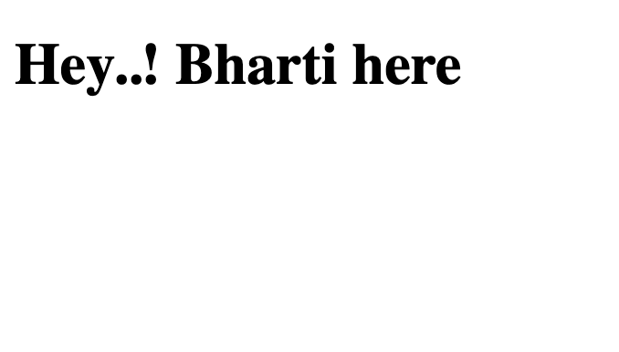

# HTML and CSS 101

#### By:Amazing Prof. Shah

* Basic of html
* How to connect css file
* How to read documentation.



Javascript snippet

``` javascript
let a= 20;
let b= 20;

console.log("The final additions is:" a+b);
```
css snippet

``` css

h1{
    background-color: red;
}
```

- [x] Wrote the first h1 tag
- [x] Connected my css to html file
- [] Change the background color

Made with :heart; in MAD9013